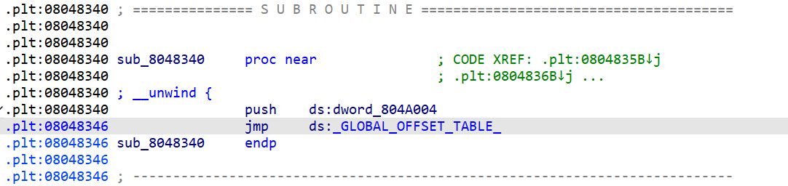

# ELF-Crackme

## Level 1.0 writeup

- 首先查看可执行文件的 ELF Header

  

- 可以发现如下问题：

  - Class 错误：应为`ELF64`
  - ~~OS 错误：~~其实没错，`Linux`确实属于`UNIX`类系统
  - Machine 错误：修改为 `Advanced Micro Devices x86-64 (AMD64)`
  - program & section header 错误：会随着 Class 修正自动修正

- **修正：** 查询 ELF 组成

  - ELF Header 中元素位置，值对应属性：[ELF Wiki](https://en.wikipedia.org/wiki/Executable_and_Linkable_Format)
  - 文件修改：`./utility.py`

- 修正后再次 `readelf -h elf-crackme-1.0` 如下：

  

## Level 3.0 writeup

- 关于动态链接，参见以下参考文档：

  [got-and-plt-for-pwning](https://systemoverlord.com/2017/03/19/got-and-plt-for-pwning.html)

  [一篇CSDN， 里面有部分错误](https://blog.csdn.net/weixin_46521144/article/details/115378030)

- 其中，重点关注如下图片：

  

  图1.1 动态链接流程图

  
  
  
  
  图片来自 **CSAPP** (不知道第几章)， 展示了一次动态链接过程，其中有以下几点值得关注：
  
  - .plt 负责进行链接，.got 负责存储偏移，其中在未进行动态链接时会简单地从.got跳转回.plt，而在动态链接后 **.got 中对应条目会指向 .extrn 中函数的对应位置**。
  
  - 在 IDA 反汇编的代码中，call addvec() 所在位置中 call 的地址为 **.plt 中负责存储函数 id 的代码部分**的地址， 其中存储的**函数id 由动态链接器 (ld.so) 决定**，随意更改会导致报错。
  
- 在本题中，**参照上图**，可以得出以下分析流程：

  1. 采用 IDA 进行分析，得到汇编代码；

  2. 找到 main 函数；

     

  3. 找到对应的 read_flag 函数；

     

  4. 对照 C 代码分析 read_flag 的代码，可以找到指向 execve 的 call 指令。在该条指令之前的一部分操作目的为存储待传递的参数。

  5. 沿call指令与图 1.1 中步骤一步步对照，可得：

     第一步，跳转到 PLT 表；

     ```assembly
     .text:080484B6 call sub_8048390 ; 指向 0x08048390, 之后的变量名也对应其所在地址
     ; 此行为 call 指令，execve入口
     ```

     第二步，形式化跳转到 GOT 表中，随即跳转回 PLT 表；

     ```assembly
     .plt:08048390 sub_8048390     proc near               ; CODE XREF: read_flag+43↓p
     .plt:08048390                 jmp     ds:off_804A01C  
     ; PLT[2]: 此行在GOT表中查找到 execve 对应地址，与上图4005C0对应。注意其当前地址为8048390
     .plt:08048390 sub_8048390     endp
     ```

     ```assembly
     .got.plt:0804A01C off_804A01C     dd offset sub_8048396   ; DATA XREF: sub_8048390↑r
     ; 此行即对应图中GOT[4]，目前仅存储PLT[2]中第二条指令的偏移地址的变量，即8048396
     ; 动态链接过程结束后，该条目将存储一个指向Section .extern中execve条目的指针
     ```

     第三步，向栈中推入所调用函数的 id，**注意：该 id 由编译时的链接器等环境决定**，再跳转到 **PLT 表的开头**。

     ```assembly
     
     .plt:08048396 sub_8048396     proc near               ; CODE XREF: sub_8048390↑j
     .plt:08048396                                         ; DATA XREF: .got.plt:off_804A01C↓o
     .plt:08048396                 push    20h ; ' '
     .plt:0804839B                 jmp     near ptr loc_8048346+4 ; AA => A0, the first change
     .plt:0804839B ; } // starts at 8048340                ; push 20h => push 05h, the second change
     .plt:0804839B sub_8048396     endp                    ; test: after making the second change, 
     .plt:0804839B
     .plt:0804839B _plt            ends
     ```

     **PLT 表开头两条指令用于召唤动态链接器，对应图中第四步，用于修改GOT表项。观察 0804839B 位置的指令，其跳转目标为PLT[1]，不符合调用流程，程序因此出错。将其跳转目标由 PLT[1] 修正为PLT[0]，即可完成此题。**

     ```assembly
     .plt:08048340 sub_8048340     proc near               ; CODE XREF: .plt:0804835B↓j
     .plt:08048340                                         ; .plt:0804836B↓j ...
     .plt:08048340 ; __unwind {
     .plt:08048340                 push    ds:dword_804A004 ; GOT[1]
     .plt:08048346
     .plt:08048346 loc_8048346:                            ; CODE XREF: sub_8048396+5↓j
     .plt:08048346                 jmp     ds:dword_804A008 ; GOT[2]: addr of dynamic linker
     .plt:08048346 sub_8048340     endp
     ```

- 分析完毕，进行 **修改**， 流程如下：

  1. `readelf -e -W elf-crackme-level3.0`  ，查看ELF header，Section Header 和 Program Header 信息；

  2. 从 Section Headers 信息中可以看到，`.plt` 节开始地址为`0x08048340`， 偏移为`0x00000340`；

     

  3. 由此可以计算出正确的`PLT[0]`位置为`0x0340`，需修改的指令位置为`0x039C`；

  4. 打开 010 editor，找到`0x039C`位置，可以观察到其机器码为`E9 AA FF FF FF`，为近距离 JMP 的小端格式，与上文中汇编代码对应；

     

  5. 计算可得，机器码中当前 JMP 目标位置为 `IP-0x56 ` ，实际正确目标位置应为 `IP-0x60`，因此将 `0x039D`位置的 AA 修改为 A0， **解题完毕**。

     完成题目效果如下所示：

     

     其中，No such file or directory 问题可以将目录切换至/usr/bin下再执行该程序来解决。

- 其他事项：

  如果修改 id， 报错如下所示：

  

---

## Level 3.1 Writeup



如图，由3.0可知，应该 JMP 到GOT[2]，但此处 JMP 目标为 GOT[0]，错误。

---
